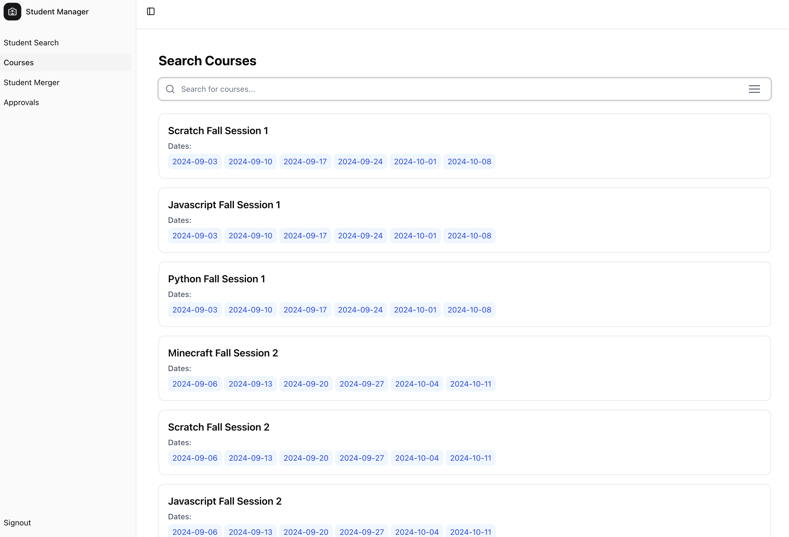
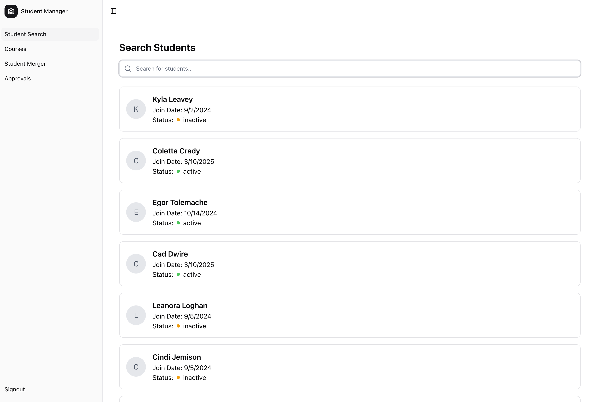
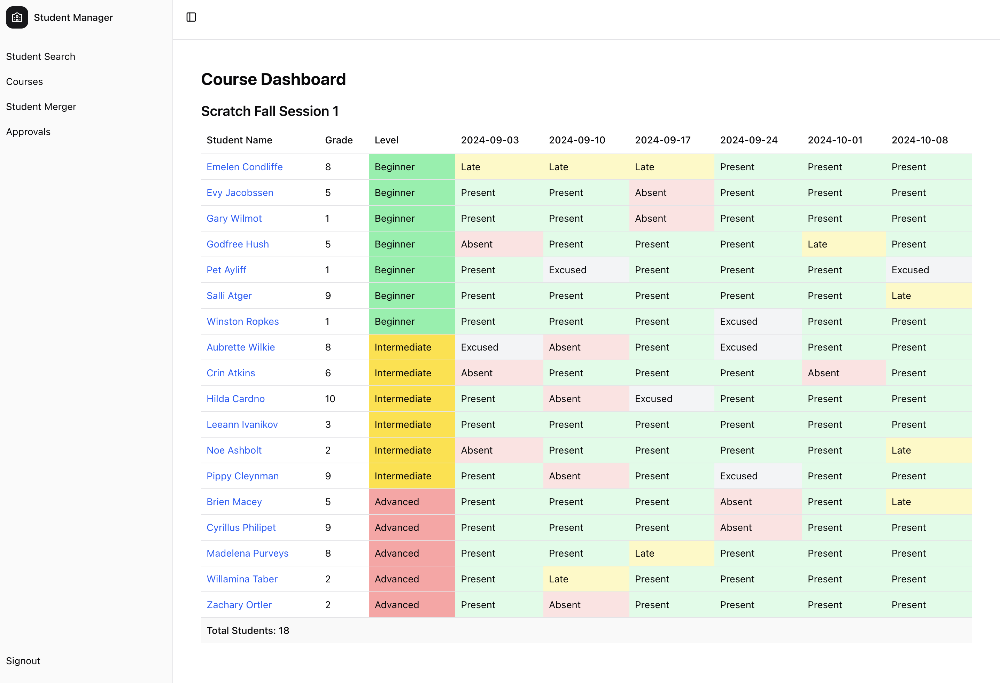
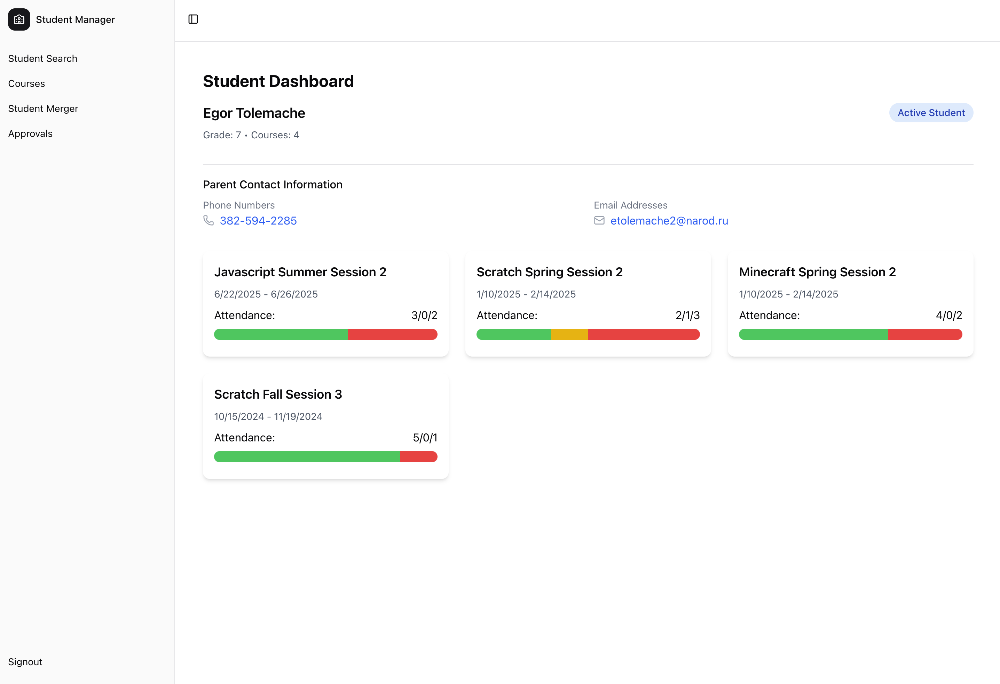
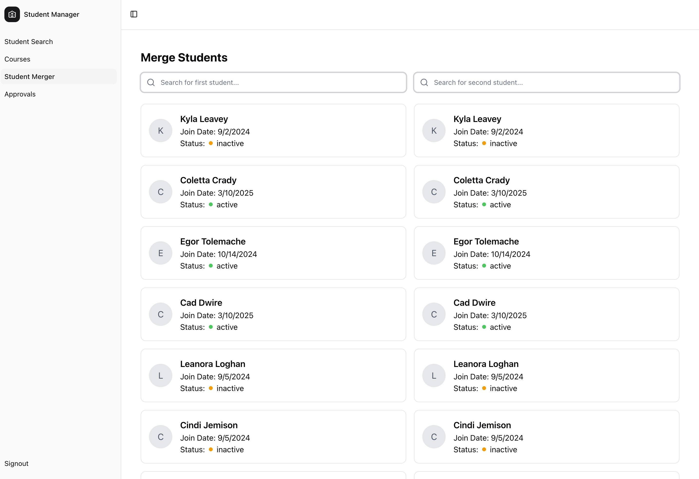
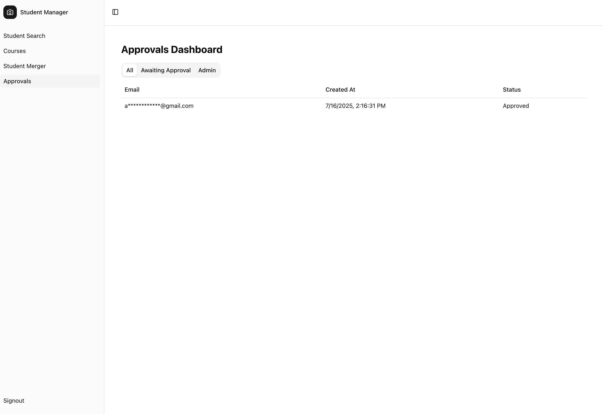

# Student Manager

A modern application for managing student information.

## Overview

A pretty simple student tracker that's used to track attendance and search for students enrolled in classes. Developed for organizations that need a straightforward solution for searching student class history for future reference.

> [!NOTE]
> Try the live demo at [https://student-manager-ivory.vercel.app](https://student-manager-ivory.vercel.app).

## Features

- Course searching
- Student searching including phone number, email, and name
- Attendance statistics per-day, including present/late/absent/excused
- User role management (admin, teacher)

## Screenshots
A few screenshots of the website:
<table>
    <tr>
        <td>
            
            <p>Course Search Page</p>
        </td>
        <td>
            
            <p>Student Search Page</p>
        </td>
    </tr>
    <tr>
        <td>
            
            <p>Course Page</p>
        </td>
        <td>
            
            <p>Student Page</p>
        </td>
    </tr>
    <tr>
        <td>
            
            <p>Merge Page</p>
        </td>
        <td>
            
            <p>Approvals Page</p>
        </td>
    </tr>
</table>

## Usage/demo

Get started by signing up for an account at [https://student-manager-ivory.vercel.app](https://student-manager-ivory.vercel.app).

## Setting up loaclly

To set up the project locally, follow these steps:
1. Create a supabase project
2. Set the following environment variables in a `.env` file:
   ```
   NEXT_PUBLIC_SUPABASE_ANON_KEY=
   NEXT_PUBLIC_SUPABASE_URL=
   ```
3. Install the dependencies:
   ```bash
    npm install
    ```
4. Run Nextjs:
    ```bash
    npm run dev
    ```
   